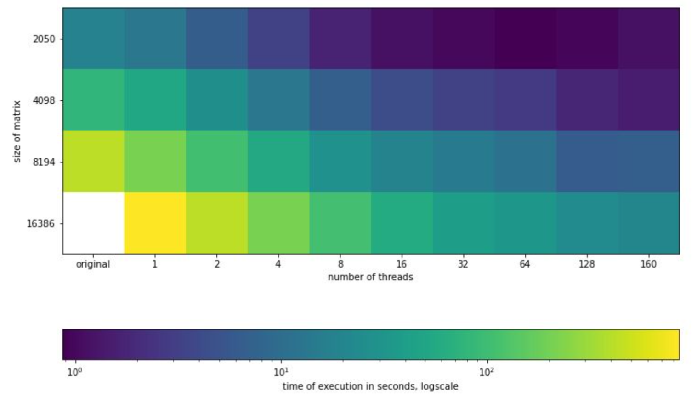
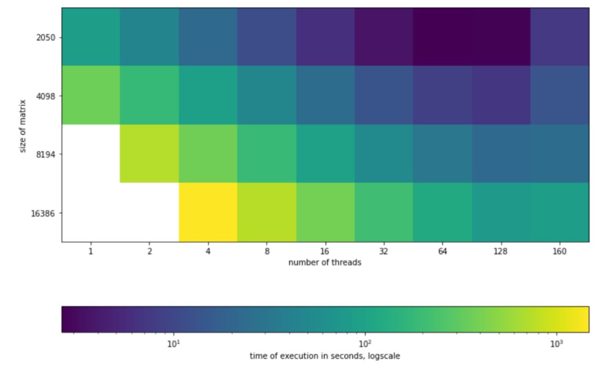

# Parallel Version of the Program for the Red-Black2D Task
course "Supercomputers and Parallel Data Processing" 

## OpenMP version
```
$ gcc -std=c99 -Wall -fopenmp -o run redb_2d.c  # compile
$ OMP_NUM_THREADS=8 ./run  # run
```
Time of execution


## MPI version
```
$ $ mpicc -std=c99 -o run_1 redb_2d.c -lm  # compile
$ mpisubmit.bg -n 8 -w 00:30:00 run # run
```
Time of execution


[Detailed report](./отчёт_openmp_mpi.pdf)

